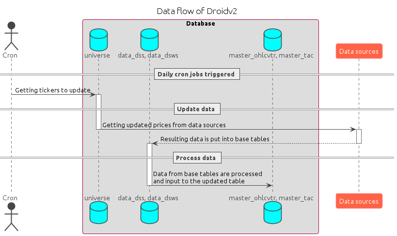

## Flow

## Commands don't delete

### docker login

- aws ecr get-login-password --region ap-northeast-2 | docker login --username AWS --password-stdin 736885973837.dkr.ecr.ap-northeast-2.amazonaws.com

### docker build and push to ecr

- docker build . -t celery-portfolio-job -f deployment/batch/Dockerfile.celery
- docker tag celery-portfolio-job:latest 736885973837.dkr.ecr.ap-northeast-2.amazonaws.com/celery-portfolio-job:latest
- docker push 736885973837.dkr.ecr.ap-northeast-2.amazonaws.com/celery-portfolio-job:latest

# Notes

- you need to run celery in your local machine and docker installed (to run redis). To install docker, run `./installer/install-docker.sh`
- if you run into "redis.exceptions.ConnectionError: Error 111 connecting to 127.0.0.1:6379. Connection refused.", run: `docker run -p 6379:6379 -d redis:5`
- run Celery using this command: `celery -A core.services worker -l  INFO --hostname=localdev@%h -Q localdev`

# asklora install

### requirements need to meet

- python 3.8
- os ubuntu >= 20

### install step

1. Run talib and aws dependency
   - `sudo ./installer/requirement.sh`
2. Run install python requirements in activated environment
   - `pip install -r installer/requirements_no_AI.txt`

### requirements need to meet

- python 3.6
- os ubuntu >= 18.0

### install step

1. Run talib and aws dependency
   - `sudo ./installer/requirement.sh`
2. Run install python requirements in activated env
   - `pip install -r installer/requirements_no_AI_36.txt`
